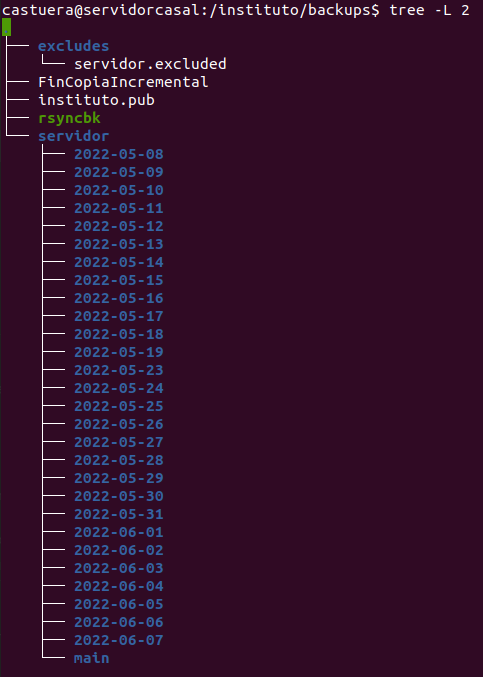

# Backup con Rsync

Comando y estructura básica para la realización de copias de seguridad de una máquina y mantener los diferenciales de los últimos 30 días.

- Usa rsync para la copia de datos
- Necesita una relación de confianza con la máquina
- Mantiene una copia actualizada
- Tiene los diferenciales de los últimos 30 días
- Archivo excludes para indicar que carpetas no queremos copiarcidencias

## Uso

### Tener accesible el módulo
Descargar el zip, descomprimir y  copiar la carpeta `backup` en la máquina que va a realizar la copia de seguridad (muy recomendable que sea diferente a la máquina de la cual queremos hacer copias de seguridad), como sugerencia el comando lo pone en la ruta `/root/backups`

```
wget https://github.com/raultm/ies-recursos/releases/download/backups_1.0.0/backups.zip

unzip  backups.zip

scp -r ./backup root@*MAQUINA*:/root/backups
```

### Añadir al cron la tarea

Añadir el comando `rsyncbk` al crontab. En mi caso a las 16:50 de la tarde. Decide la hora en que no haya nadie en el edificio

```
crontab -e
```
Añadir la línea

```
50 16 * * * /root/backups/rsyncbk
```

### Configurar la copia

En `rsyncbk` está toda la información necesaria para la copia

Hay unos parámetros de configuración
```bash
#!/bin/sh
# Custom Configuration
#   HOSTNAME: Name of machine to bakcup
#   BACKUPDIR: Directory to backup
#   EXCLUDES: Paths to avoid in the backup
#   ARCHIVEROOT:root directory to for backup stuff
HOSTNAME=servidor
BACKUPDIR=/
EXCLUDES=/root/backups/excludes/$HOSTNAME.excluded
ARCHIVEROOT=/root/backups

# General Configuration (not touch unless you know what you are doing)
#   CURRENT: directory which holds our current datastore
#   INCREMENTDIR: directory which we save incremental changes to
#   DIASBACKUP: Dias que se guardará el backup
#   OPTIONS; Option to pass to rsync
CURRENT=main
INCREMENTDIR=`date +%Y-%m-%d`
DIASBACKUP=30
OPTIONS="--force --ignore-errors --delete --delete-excluded --exclude-from=$EXCLUDES --backup --backup-dir=$ARCHIVEROOT/$HOSTNAME/$INCREMENTDIR -av"
```

### Copiar clave publica de root
Necesita que la máquina de la que quieras hacer copias (servidor) permita a la máquina que realiza la copia (backups) acceder sin contraseña.

En la máquina que va a hacer la copia de seguridad
1. ¿No tienes el archivo `~/.ssh/id_rsa.pub`? Pues a crearlo con `ssh-keygen`
2. Pasar la clave pública al otro ordenador con `ssh-copy-id`, lo que hace esto es dejar la información en `~/.ssh/authorized_keys` de *servidor*

```
if [[ ! -f ~/.ssh/id_rsa ]]; then ssh-keygen -t rsa; fi;

ssh-copy-id -i ~/.ssh/id_rsa.pub root@servidor
```

### Archivos

El paquete añade archivos en profile.d, sudoers.d y un comando local

<dl>
  <dt><strong>/root/backups/rsyncbk</strong></dt>
  <dd>Comando que es llamado por el cron y realiza la copia</dd>
  <dt><strong>/root/backups/FinCopiaIncremental</strong></dt>
  <dd>La fecha de la última copia correcta. A modo informativo</dd>
  <dt><strong>/root/backups/excludes/servidor.excluded</strong></dt>
  <dd>Las rutas de las que no queremos hacer copias de seguridad</dd>
  <dt><strong>/root/backups/excludes/main</strong></dt>
  <dd>La última copia de seguridad realizada</dd>
  <dt><strong>/root/backups/excludes/<i>YYYY-MM-DD</i></strong></dt>
  <dd>Los archivos que ha sido modificados (actualizados/eliminados). La diferencia entre la última copia que existía y la que se acaba de realizar.</dd>
</dl>



